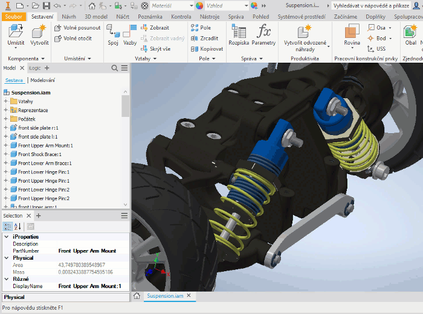

# Autodesk-Inventor

<b>Tools for Autodesk Inventor</b>

<b>SelectionInfo</b> is a sample add-in application for Autodesk Inventor by CAD Studio - it displays the iProperties palette as a modeless UI element in Inventor.
With this add-in you can immediately show preset document properties (like Part Number, Mass or Area) of any component clicked in the model or in the browser tree.

You can modify the C# file <i>SelectionInfoSelector.cs</i> to include any other iProperties you want to display in the Selection palette. Then use MS Visual Studio to recompile the application. You can also just install the precompiled DLL for Inventor 2018 and higher.

 <b>Installation</b>
 - see <a href="SelectionInfo/SelectionInfo/Readme.txt">Readme.txt</a>

Contact CAD Studio at <a href="https://www.cadstudio.cz">www.cadstudio.cz</a> or <a href="https://www.cadforum.cz">www.cadforum.cz</a> or Facebook: <a href="https://www.facebook.com/CADstudio">@CADstudio</a> for more information.
