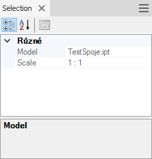

# Selection info - installation+compilation+customization
## Česky
### Instalace
Instalace se provádí zkopírováním souborů z archivu [out/Release.zip](out/Release.zip) do lokálního adresáře. 

Například:
* Pro všechny lokální uživatele
  * *C:\ProgramData\Autodesk\ApplicationPlugins\SelectionInfo.bundle\\*
* Pro aktuálního uživatele
  * *C:\Users\USER_NAME\AppData\Roaming\Autodesk\ApplicationPlugins\SelectionInfo.bundle\\*

Poslední adresář *SelectionInfo.bundle* neexistuje a je nutné jej vytvořit ručně.

### Kompilace
Pro kompilaci lze použít [Visual Studio 2017](https://visualstudio.microsoft.com/cs/downloads/) nebo novější. Lze použít i verzi *Community Edition*, která je zdarma. 
Pokud chcete během kompilace vytvářet archiv se všemi potřebnými soubory AddInu, je potřeba mít nainstalovaný i [7-Zip](https://www.7-zip.org/download.html).

Jako cílová platforma se používá Inventor 2017 či novější a knihovny .NET Framework 4.7. Pokud potřebujete provést kompilaci pro starší verzi Inventoru, je potřeba upravit referenci na *Autodesk.Inventor.Interop* příslušné verze. Zpětná kompatibilita ale není zaručena.

### Základní struktura zdrojového kódu
#### [StandardAddInServer.cs](SelectionInfo/StandardAddInServer.cs)
Základní třída pro zavedení AddInu do Inventoru. Obsahuje definice základních objektů a obsluhuje obecné chování při spuštění, za běhu a při ukončování.

#### [SelectionInfoSelector.cs](SelectionInfo/SelectionInfoSelector.cs)
Tato třída je zodpovědná za rozhodování, jaká data budou zobrazena pro vybraný objekt. Pokud pro vybraný objekt není definován žádný popis, vrací `null` a v okně se nic nezobrazí.

#### [DocumentiProperties.cs](SelectionInfo/DocumentiProperties.cs)
Tato třída zajišťuje přístup k iVlastnostem dokumentu. Obsahuje přímý přístup ke standardním iVlastnostem, které je možné přímo zobrazit. U těchto iVlastností je určen i datový typ. Některé iVlastnosti jsou definovány jak pro čtení, tak pro zápis a některé jsou určeny pouze pro čtení. 

Dále obsahuje dvě metody, které slouží pro přístup k uživatelským iVlastnostem.

#### `UserDefined(string name)`
Tato metoda vrací hodnotu uživatelské iVlastnosti definované jejím názvem. Pokud taková iVlastnost neexistuje, je zobrazeno chybové hlášení.

#### `UserDefined(string name, object value)`
Tato metoda nastavuje hodnotu uživatelské iVlastnosti definované jejím názvem na hodnotu argumentu `value`. Pokud taková iVlastnost neexistuje, není možné hodnotu nastavit, ani se vlastnost nevytvoří. 

#### [PhysicalProperties.cs](SelectionInfo/PhysicalProperties.cs) 
Tato třída zajišťuje přístup k fyzikálním vlastnostem daného CAD dokumentu.
Jako vstupní argument je vyžadován dokument součásti nebo sestavy. Pro jiné typy dokumentů nevrací žádné hodnoty.

##### `Area(string units)`
Metoda `Area` vrací celkovou plochu modelu. Jako argument `units` je možné zadat měrnou (plošnou) jednotku, ve které je požadován výstup. Nejčastěji je to řetězec určující jednotku stejně, jako je tomu v parametrech, například "m^2" nebo "m&ast;m" pro výstup v metrech čtverečních. Pokud není jednotka definována, vrací se výsledek ve výchozích jednotkách Inventoru, což jsou cm^2.

##### `Mass(string units)`
Metoda `Mass` vrací celkovou hmotnost modelu. Jako argument `units` je možné zadat měrnou (váhovou) jednotku, ve které je požadován výstup. Nejčastěji je to řetězec určující jednotku stejně, jako je tomu v parametrech, například "g" nebo "lb" pro výstup v gramech nebo librách. Pokud není jednotka definována, vrací se výsledek ve výchozích jednotkách Inventoru, což jsou kg.

##### `Volume(string units)`
Metoda `Volume` vrací celkový objem modelu. Jako argument `units` je možné zadat měrnou (objemovou) jednotku, ve které je požadován výstup. Nejčastěji je to řetězec určující jednotku stejně, jako je tomu v parametrech, například "m^3" nebo "m&ast;m&ast;m" pro výstup v metrech krychlových. Pokud není jednotka definována, vrací se výsledek ve výchozích jednotkách Inventoru, což jsou cm^3.

#### [DocumentInfo.cs](SelectionInfo/DocumentInfo.cs)
Tato třída definuje vlastnosti, které budou zobrazeny, pokud je vybraný objekt dokument, nebo je na dokument převoditelný. Například výskyt dokumentu v sestavě.

#### [OccurrenceInfo.cs](SelectionInfo/OccurrenceInfo.cs)
Tato třída definuje vlastnosti, které se budou zobrazovat, pokud je vybraný objekt výskyt dokumentu v sestavě. Zobrazuje všechny informace, které jsou definovány v [DocumentInfo.cs](SelectionInfo/DocumentInfo.cs) a doplňuje další, které jsou specifické pro výskyt. Například `DisplayName`, což je název výskytu ve stromě sestavy.

## Příklady kódu
### Doplnění dalšího objektu pro zobrazení informací
V tomto příkladu je ukázáno, jak je možné stávající kód rozšířit na zobrazení informací o výkresovém pohledu.

1. Vytvoření třídy pro popis výkresového pohledu

>Třídu vytvořte jako samostatný soubor, například *DrawingViewInfo.cs*. Do tohoto souboru vytvořte kód podle následujícího příkladu. V další fázi můžete kód upravit podle svého uvážení a potřeby.

```csharp
  class DrawingViewInfo
  {
      private readonly DrawingView drawingView;
  
      public DrawingViewInfo(DrawingView drawingView)
      {
          this.drawingView = drawingView;
      }
  
      /// <summary>
      /// Gets the scale of the drawing view.
      /// </summary>
      /// <value>
      /// The scale.
      /// </value>
      public string Scale => drawingView.ScaleString;
  
      /// <summary>
      /// Gets the model display name referenced by drawingView.
      /// </summary>
      /// <value>
      /// The model.
      /// </value>
      public string Model
      {
          get
          {
              var model = drawingView.ReferencedDocumentDescriptor;
              if (model == null)
                  return "No Model";
              else
                  return model.DisplayName;
          }
      }
  }
```

2. Rozšíření seznamu použitelných objektů

>V souboru [SelectionInfoSelector.cs](SelectionInfo/SelectionInfoSelector.cs) upravte metodu `GetSelectionInfo` podle následujícího příkladu.

```csharp
public static object GetSelectionInfo(object selectedEntity)
{
    switch (selectedEntity)
    {
        case ComponentOccurrence occ:
            return new OccurrenceInfo(occ);
        case PartComponentDefinition partDef:
            return new DocumentInfo(partDef.Document as Document);
        case AssemblyComponentDefinition asmDef:
            return new DocumentInfo(asmDef.Document as Document);
        case DrawingView drawingView:
            return new DrawingViewInfo(drawingView);
        default:
            return null;
    }
}
```

3. Dokončení

Po provedení úprav celý projekt znovu zkompilujte a proveďte aktualizaci AddInu. Teď by se při výběru výkresového pohledu měly zobrazit informace podobně jako na tomto náhledu




### Použití atributů
Pro ovládání vzhledu zobrazení v dokovacím okně je možné použít tzv. *Atributy*. Použití některých z nich uvádí následující tabulka. Atributy se deklarují v kódu těsně před hlavičku vlastnosti.

Atribut|Popis
---|---
[Category("Model")]|Umožňuje seskupovat určité vlastnosti k sobě
[DisplayName("View of")]|Přiřadí zobrazovaný název vlastnosti
[Description("Display name of the referenced model")]|Rozšířený popis toho, co vlastnost obsahuje.

Příklad použití v kódu:
```csharp
[Category("Model")]
[DisplayName("View of")]
[Description("Display name of the referenced model")]
public string Model
{
    get
    {
        var model = drawingView.ReferencedDocumentDescriptor;
        if (model == null)
            return "No Model";
        else
            return model.DisplayName;
    }
}
```

Náhled:


>**Poznámka:** Použitelných atributů je celá řada a zdaleka tu nejsou uvedeny všechny. 


-----------------------------------------------------------------------------------------------
-----------------------------------------------------------------------------------------------


## English
### Installation
Copy files from the archive [out/Release.zip](out/Release.zip) to a local folder. 

Example:
* For all users
  * *C:\ProgramData\Autodesk\ApplicationPlugins\SelectionInfo.bundle\\*
* For current user
  * *C:\Users\USER_NAME\AppData\Roaming\Autodesk\ApplicationPlugins\SelectionInfo.bundle\\*

The last folder *SelectionInfo.bundle* doesn't exist and it is necessary to create it manually.

### Compilation
For the code compilation, you can use [Visual Studio 2017](https://visualstudio.microsoft.com/cs/downloads/) or higher. You can also use the free version *Community Edition*. 
If you want to create the archive with all necessary Add-In files during the compilation, you will also need the [7-Zip](https://www.7-zip.org/download.html) installed.

Inventor 2017 or higher and .NET Framework 4.7 libraries are used as the target platform. If you need to perform compilation for older Inventor releases, you will need to adjust the reference to *Autodesk.Inventor.Interop* of the given version. But backwards compatibility is not guaranteed.

### Basic structure of the source code
#### [StandardAddInServer.cs](SelectionInfo/StandardAddInServer.cs)
A basic class for loading the AddIn into Inventor. Contains definition of basic objects and handles general behaviour on loading, on running and on exiting.

#### [SelectionInfoSelector.cs](SelectionInfo/SelectionInfoSelector.cs)
This class is responsible for decisions which data will be displayed for the selected object. If no description is defined for the selected object, it returns `null` and nothing is displayed in the palette window.

#### [DocumentiProperties.cs](SelectionInfo/DocumentiProperties.cs)
This class ensures access to the document's iProperties. It contains direct access to standard iProperties, which can be displayed directly. Even data types are defined for these iProperties. Some iProperties are defined both for reading and for writing, some are preset as read-only. 

Furthermore it contains two methods, which can be used to access custom iProperties.

#### `UserDefined(string name)`
This method returns the value of the custom iProperty defined by its name. If no such iProperty exists, an error message os displayed.

#### `UserDefined(string name, object value)`
This method sets the value of the custom iProperty defined by its name to the value of the argument `value`. If no such iProperty exists, it is neither possible to set the value, nor is the property created. 

#### [PhysicalProperties.cs](SelectionInfo/PhysicalProperties.cs) 
This class ensures access to physical properties of the given CAD document.
As an input argument, the part or assembly document is required. No values are returned for other document types.

##### `Area(string units)`
The method `Area` returns the total area of the model. As the argument `units`, you can specify an area measurement unit which should be used for the output. Usually, this is a string defining the unit in the same way as in Inventor parameters, e.g. "m^2" or "m&ast;m" for output in square meters. If no unit is defined, the output is returned in the default Inventor units which is cm^2.

##### `Mass(string units)`
The method `Mass` returns the total mass of the model. As the argument `units`, you can specify a mass measurement unit which should be used for the output. Usually, this is a string defining the unit in the same way as in Inventor parameters, e.g. "g" or "lb" for output in grams or pounds. If no unit is defined, the output is returned in the default Inventor units which is kg.

##### `Volume(string units)`
The method `Volume` returns the total volume of the model. As the argument `units`, you can specify a volume area measurement unit which should be used for the output. Usually, this is a string defining the unit in the same way as in Inventor parameters, e.g. "m^3" or "m&ast;m&ast;m" for output in cubic meters. If no unit is defined, the output is returned in the default Inventor units which is cm^3.

#### [DocumentInfo.cs](SelectionInfo/DocumentInfo.cs)
This class defines properties, which will be displayed, if the selected object is a document, or is convertible to a document. E.g. a document occurence in an assembly.

#### [OccurrenceInfo.cs](SelectionInfo/OccurrenceInfo.cs)
This class defines properties, which will be displayed, if the selected object is a document occurence in an assembly. It displays all information which is defined in [DocumentInfo.cs](SelectionInfo/DocumentInfo.cs) and adds more, those specific for the occurence. E.g. `DisplayName`, which is the name of the occurence in the assembly tree.

## See above for code examples
